<!-- Language switcher -->

  
  

<!-- Hero banner: auto-switches with GitHub light/dark theme -->
<picture>
  <source media="(prefers-color-scheme: dark)" srcset="./dark.svg">
  <source media="(prefers-color-scheme: light)" srcset="./light.svg">
  
</picture>

 

## 👋 About me

Frontend developer based in Krasnodar, Russia — open to Moscow / Saint Petersburg and remote.
I build web interfaces with **React** and **TypeScript** — from customer-facing platforms
to internal admin panels and commercial sites. Currently focused on UI engineering, clean
component architecture, and getting sharper at algorithms.

- 💼 1+ year of commercial frontend experience
- 🧩 Working with React · TypeScript · Vue.js · Node.js
- 🧠 Solving algorithm problems on LeetCode, building side projects & taking freelance work
- 🎓 Kuban State University, 2025
- 📫 Reach me: **genrihbag@gmail.com** · [Telegram](https://t.me/GENBGG)

## 🛠️ Tech stack

## 🚀 Featured work

| Project | What it is | Stack |
|---|---|---|
| [kinder-clinic.ru](https://kinder-clinic.ru) | Medical web platform — online booking + patient dashboard | React, TypeScript |
| [dentboard.ru](https://dentboard.ru) | Commercial website for a clinic direction | React, TypeScript |

> Pin your best repositories below so visitors see real code, not just links.

## 🔗 Links

  <a href="https://github.com/genrihbag">GitHub</a> ·
  <a href="https://t.me/GENBGG">Telegram</a> ·
  <a href="mailto:genrihbag@gmail.com">Email</a>

