<!-- Переключатель языка -->

<b>Русский</b> · <a href="./README.md">English</a>

<!-- Баннер: сам переключается со светлой/тёмной темой GitHub -->
<picture>
  <source media="(prefers-color-scheme: dark)" srcset="./dark-ru.svg">
  <source media="(prefers-color-scheme: light)" srcset="./light-ru.svg">
  
</picture>

 

## 👋 Обо мне

Frontend-разработчик из Краснодара — готов к переезду в Москву / Санкт-Петербург и к удалёнке.
Разрабатываю веб-интерфейсы на **React** и **TypeScript** — от клиентских платформ
до внутренних админ-панелей и коммерческих сайтов. Сейчас в фокусе — UI-инженерия, чистая
архитектура компонентов и прокачка алгоритмов.

- 💼 Больше года коммерческого опыта во фронтенде
- 🧩 Работаю с React · TypeScript · Vue.js · Node.js
- 🧠 Решаю задачи на LeetCode, делаю пет-проекты и беру фриланс
- 🎓 Кубанский государственный университет, 2025
- 📫 Связь: **genrihbag@gmail.com** · [Telegram](https://t.me/GENBGG)

## 🛠️ Стек

## 🚀 Проекты

| Проект | Что это | Стек |
|---|---|---|
| [kinder-clinic.ru](https://kinder-clinic.ru) | Медицинская веб-платформа — онлайн-запись + личный кабинет пациента | React, TypeScript |
| [dentboard.ru](https://dentboard.ru) | Коммерческий сайт направления клиники | React, TypeScript |

> Закрепите лучшие репозитории ниже, чтобы посетители видели реальный код, а не только ссылки.

## 📊 Статистика GitHub

  
  

  <a href="https://github.com/genrihbag">GitHub</a> ·
  <a href="https://t.me/GENBGG">Telegram</a> ·
  <a href="mailto:genrihbag@gmail.com">Почта</a>

